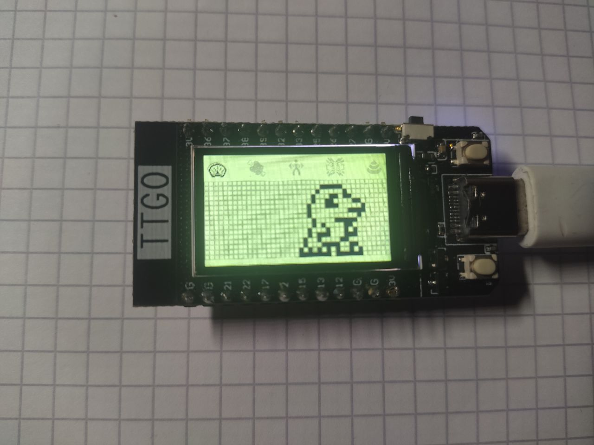

# Digimon V-Pet for ESP32/Arduino
This is an early version of a Digimon VPet for the ESP32 and other Arduino compatible devices. 
It's based on the [TFT_eSPI](https://github.com/Bodmer/TFT_eSPI/) and should be compatible with every other Display supported by the Library. 
But on the long-term this project will be independet of TFT_eSPI in order to make it compatible with more displays. 
The Goal of this project is to implement a Digimon VPet with all the functionality of real VPets and compatibility to real Digimon VPets.

At the moment there is just the UI implemented but no functionality. But the Long Term goals are:

Hardware independence:
- the ardware should be highly customizable, so you can use different displays, different inputs etc. 

Functionality:
- Internet connectivity through WiFi
- [A-/D-Com](https://www.alphahub.site/guide) functionality 
- it should have a function to act as a gate, to allow 2 people to fight/jogress/... with their original VPETs through the internet
- it should be compatible to real VPETs (so you can fight/jogress/... ESP-VPET vs Original-VPET)
- ability to connect via bluetooth to other ESP32 Vpets to fight/jogress/...

Customizable: 
- it should be easy to add new digimon/pets/evolution lines
- it should be easy to change game mechanics and the UI

